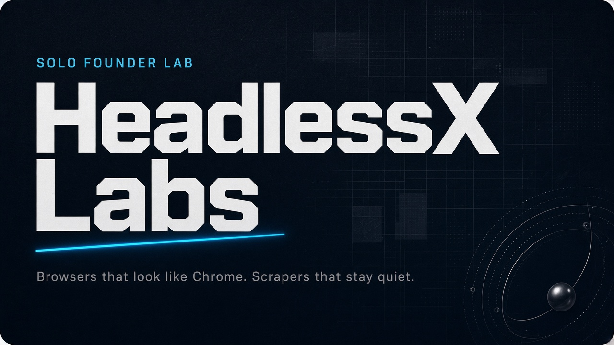

<p align="center">
  
</p>

<p align="center">
  <a href="https://saify.me"></a>
  <a href="mailto:hello@saify.me"></a>
  <a href="https://headlessx.dev"></a>
  <a href="https://github.com/HeadlessXLabs/hexium-browser"></a>
  <a href="https://pypi.org/project/hexium-browser/"></a>
</p>

**Solo founder. Solo developer.** [Saifullah](https://saify.me) · [hello@saify.me](mailto:hello@saify.me)

You hire this lab for one job: sites should see Chrome. Your scripts should still be Playwright.

## Start here

[**hexium-browser**](https://github.com/HeadlessXLabs/hexium-browser) is public now. `launch()` in. Chrome 151 out.

```bash
pip install hexium-browser
pip install 'hexium-browser[geoip]'
hexium-browser fetch
```

```python
from hexium_browser import launch
browser = launch(headless=True)
```

## Coming next (open source)

Shipped in this order. Thanks for waiting — one person, one repo at a time.

| # | Project | Job |
| --- | --- | --- |
| 1 | **hexium-cli** | Same Hexium binary, from a terminal |
| 2 | **HeadlessX 2.5** | Scrape platform that launches Hexium |
| 3 | **hexium-desktop** | Daily browser with its own `{ AI }` panel |
| 4 | **hexium-onboarding** | First-run wizard only |

Docs land on [docs.headlessx.dev](https://docs.headlessx.dev) as each one exists.

## HeadlessX 2.1

[HeadlessX 2.1](https://github.com/saifyxpro/HeadlessX) lives on **[@saifyxpro](https://github.com/saifyxpro)** today. After **2.5** is built, it moves into this org.

Stars and issues on that repo still count until the move.

## Contact

[hello@saify.me](mailto:hello@saify.me) · [saify.me](https://saify.me) · [headlessx.dev](https://headlessx.dev)
